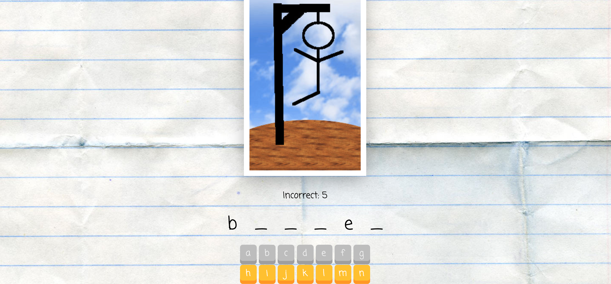

# 👾 arcade-hero-greatest-hits 🎮

Various project games made in my free time!

## Noughts & Crosses

The player who succeeds in placing three of their marks in a horizontal, vertical, or diagonal row is the winner.

## Breakout

In Breakout, a layer of bricks lines the top third of the screen and the goal is to destroy them all.

## Dice

A React SPA RNG Dice roller.

## Hangman

Hangman is a paper and pencil guessing game for two or more players. One player thinks of a word, phrase or sentence and the other(s) tries to guess it by suggesting letters within a certain number of guesses.

---

## Technologies & Frameworks

- [Create-React-App](https://reactjs.org/docs/create-a-new-react-app.html)
- [CSS](https://developer.mozilla.org/en-US/docs/Web/CSS)
- [HTML](https://developer.mozilla.org/en-US/docs/Web/HTML)
- [Javascript](https://developer.mozilla.org/en-US/docs/Web/JavaScript)
- [React](https://reactjs.org/)

