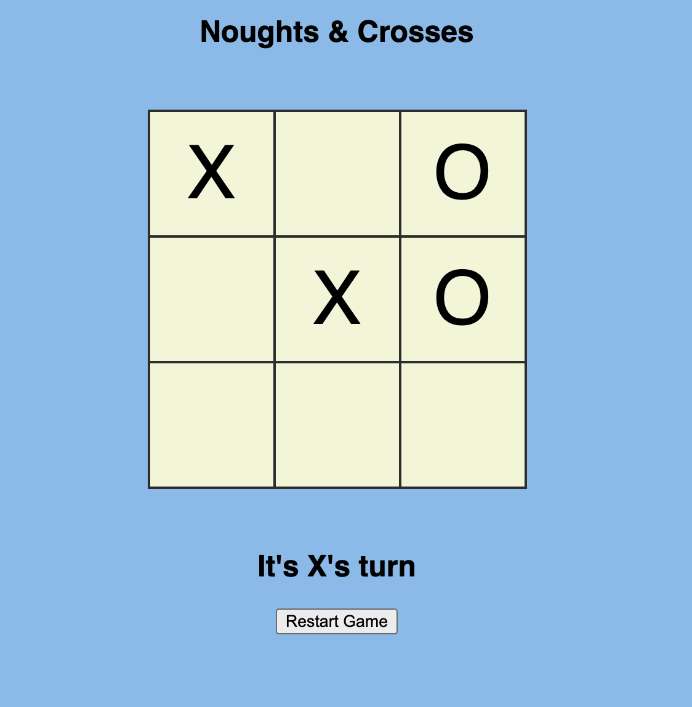
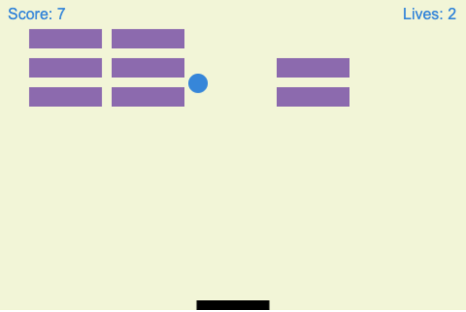

# 👾 arcade-hero-greatest-hits 🎮

Various project games made in my free time!

## Noughts & Crosses

The player who succeeds in placing three of their marks in a horizontal, vertical, or diagonal row is the winner.

## Breakout

In Breakout, a layer of bricks lines the top third of the screen and the goal is to destroy them all.

---

## Technologies & Frameworks

- [HTML]()
- [CSS]()
- [Javascript]()
